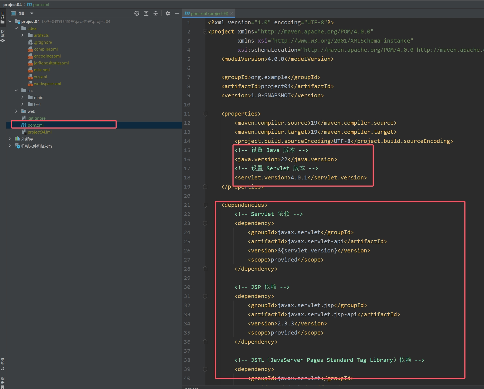
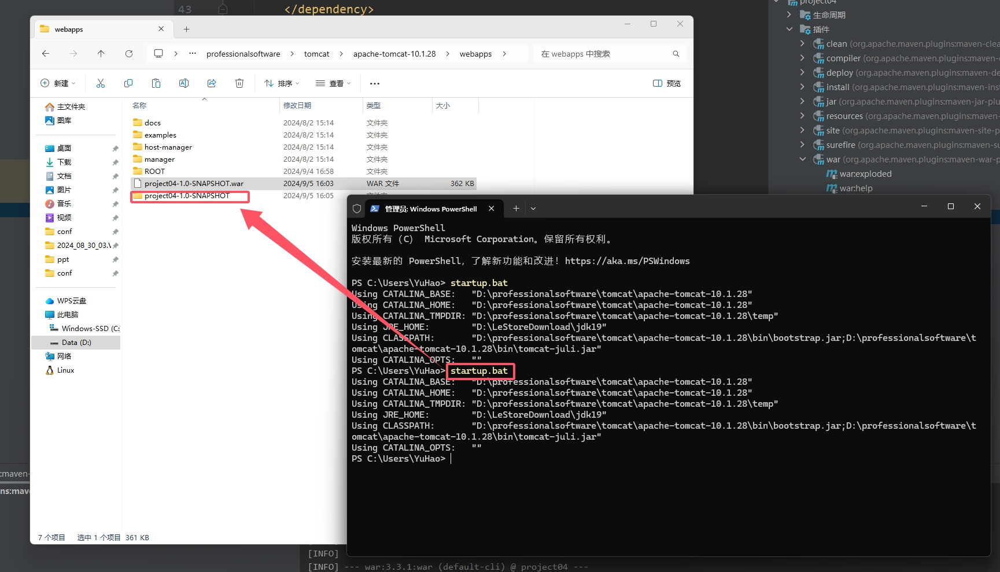

# Javaweb作业

## 作业一 hello world的实现

### 安装maven：

- 1.解压apache-maven-3.9.9-bin.zip
- 2.配置本地仓库：修改conf/settings.xml中的\<localRepository\>为一个指定目录:\<localRepository\>D:professionalsoftwaremavenapache-maven-3.9.9mvn*repo\</localRepository\>*
- 3.配置阿里云私服：修改conf/settings.xml中的\<mirrors\>标签，为其添加如下子标签：\<mirror\>\<id\>alimaven\</id\>

    \<name\>aliyun maven\</name\>     \<url\>[http://maven.aliyun.com/nexus/content/groups/public/](http://maven.aliyun.com/nexus/content/groups/public/)\</url\>

    \<mirrorOf\>central\</mirrorOf\>

    \</mirror\>

- 4.配置环境变量：
    - 在系统变量中新建一个MAVEN*HOME变量，设置变量名跟变量值*
    - 将MAVEN*HOME配置到系统环境变量path中*

　　　双击path变量，新建一参数，输入%MAVEN*HOME%**bin后点击确定即可。*

- 5.验证：在cmd中输入命令 mvn -v显示如下则成功：

### 在idea里配置maven环境

- 1.（配置全局参数）：

点击进入，后续操作与2、3、4一致。

- 2.进入idea，点击 文件-设置-构建、执行、部署-构建工具-Maven：配置安装目录，settings文件目录，本地仓库目录
- 3.点击 文件-设置-构建、执行、部署-构建工具-Maven-运行程序：选择自己的jdk版本
- 4.点击 文件-设置-构建、执行、部署-编译器-Java编译器：选择与jdk一致的版本

### 安装tomcat：

- 1.下载：[https://tomcat.apache.org/download-10.cgi](https://tomcat.apache.org/download-10.cgi)

- 2.解压并配置环境变量
- 
- 3.启动服务：

    

### 在idea里配置tomcat：

- 1.进入idea，点击 文件-设置-插件：搜索Smart Tomcat安装并应用-确定

### 简单实现helloworld：

- 建立新项目，如下，注意不要选择Maven Archetype，而是之间建立新建项目后选择maven。

- 点击：文件-项目结构-模块-加号-Web-应用-确定

- 点击：工件-web应用程序：展开型（这里选择归档也行，只是最后打包方式不同而已）

- 点击：选择运行/调试配置-加号-Smart Tomcat-应用-确定

- 配置如下：（注意Context path这里要写 ）

- 在pom.xml文件里设置java版本、servlet版本，添加依赖

- 在web文件下的WEB-INF下建一个html文件，并写一个简单的页面

- 在web.xml文件里写如下代码

- 若工件是-web应用程序：展开型，则在pom.xml文件里添加如下代码，然后点击：maven-重新加载，加载完毕后会出现一个war包

- 这个war包会在tomcat目录下的webapps里，在终端执行startup.bat后会出现一个同名字文件夹

- 现在配置http密钥，在终端里将密钥粘贴并执行

- 然后在tomcat目录下的conf文件夹下出现一个mykeystore.jks文件，记住这个文件的目录，后续要用；
- 点击server.xml文件进行配置

- 在server.xml文件里找到如下标签，并修改路径（绝对路径），这里的密码是执行密钥那一步设置的密码，保存退出

- 在浏览器里访问  localhost：8443/project04-1.0-SNAPSHOT（也就是localhost：8443/＋war包的名字）

