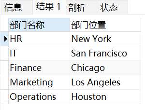
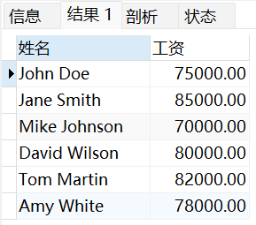
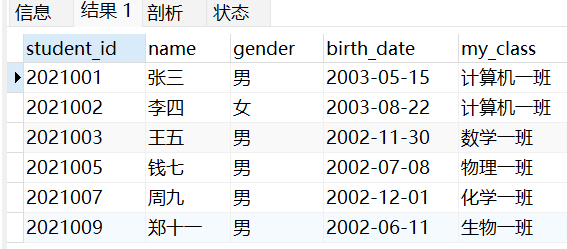
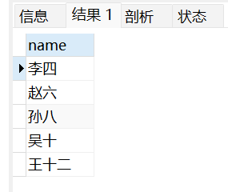

# 《作业四：SQL查询练习》

> **学院：省级示范性软件学院**
>
> **课程：JavaWeb后端开发技术**
>
> **题目：《作业四：SQL查询练习》**
>
> **姓名：唐玉亮**
>
> **学号：2100230021**
>
> **班级：软工2202**
>
> **日期：2024-10-02**

## 1 员工信息练习题

### 1.1 查询所有员工的姓名、邮箱和工作岗位。

代码：

``` mysql
select concat(e.first_name," ",e.last_name) 姓名,email 邮箱,job_title 工作岗位
from employees e;
```

结果：


### 1.2 查询所有部门的名称和位置。

代码：

``` mysql
select d.dept_name 部门名称,d.location 部门位置
from departments d;
```

结果：



### 1.3 查询工资超过70000的员工姓名和工资。

代码：

``` mysql
select concat(e.first_name," ",e.last_name) 姓名,salary 工资
from employees e
where e.salary>=70000;
```

结果：



### 1.4 查询IT部门的所有员工。

代码：

``` mysql
select e.*
from departments d,employees e
where d.dept_id=e.dept_id and d.dept_name="IT";
```

结果：


### 1.5 查询入职日期在2020年之后的员工信息。

代码：

``` mysql
select *
from employees e
where year(e.hire_date)>2019;
```

结果：


### 1.6 计算每个部门的平均工资。

代码：

``` mysql
select d.dept_name,avg(salary) 
from employees e,departments d
where e.dept_id=d.dept_id
group by d.dept_name;
```

结果：


### 1.7 查询工资最高的前3名员工信息。

代码：

``` mysql
select *
from employees e
order by salary desc 
limit 3;
```

结果：


### 1.8 查询每个部门员工数量。

代码：

``` mysql
select d.dept_name,count(*)
from employees e,departments d
where e.dept_id=d.dept_id
group by d.dept_name;
```

结果：


### 1.9 查询没有分配部门的员工。

代码：

``` mysql
select *
from employees e
where e.dept_id=null;
```

结果：


### 1.10 查询参与项目数量最多的员工。

代码：

``` mysql
select e.*,count(*) total_proj
from employees e,employee_projects ep
where e.emp_id=ep.emp_id
group by e.emp_id
having total_proj=(
	select count(*) total_proj
	from employees e,employee_projects ep
	where e.emp_id=ep.emp_id
	group by e.emp_id
	limit 1	
);
```

结果：


### 1.11 计算所有员工的工资总和。

代码：

``` mysql
select sum(e.salary) 工资总和
from employees e; 
```

结果：


### 1.12 查询姓"Smith"的员工信息。

代码：

``` mysql
select e.*
from employees e
where e.last_name="Smith"; 
```

结果：


### 1.13 查询即将在半年内到期的项目。

代码：

``` mysql
select p.project_name
from projects p
where p.end_date between CURRENT_DATE() and ADDDATE(CURRENT_DATE(),188);
```

结果：


### 1.14 查询至少参与了两个项目的员工。

代码：

``` mysql
select e.*,count(*)
from employees e,employee_projects ep,projects p
where e.emp_id=ep.emp_id and ep.project_id=p.project_id
group by first_name
having  count(*)>=2;
```

结果：


### 1.15 查询没有参与任何项目的员工。

代码：

``` mysql
select e.*
from employees e
where e.emp_id not in(
	select e.emp_id
	from employees e,employee_projects ep,projects p
	where e.emp_id=ep.emp_id and ep.project_id=p.project_id
);
```

结果：


### 1.16 计算每个项目参与的员工数量。

代码：

``` mysql
select p.project_name,count(*)
from employees e,employee_projects ep,projects p
where e.emp_id=ep.emp_id and ep.project_id=p.project_id
group by p.project_id;
```

结果：


### 1.17 查询工资第二高的员工信息。

代码：

``` mysql
WITH ranked_employees AS (
	 SELECT e.*,RANK() OVER(ORDER BY e.salary DESC) AS salary_rank
	 FROM employees e
)
select *
from ranked_employees
where salary_rank=2;
```

结果：


### 1.18 查询每个部门工资最高的员工。

代码：

``` mysql
WITH ranked_employees AS(
	SELECT e.*, d.dept_name,RANK() OVER(partition by d.dept_id ORDER BY e.salary DESC) AS salary_rank
	FROM employees e,departments d
	where e.dept_id=d.dept_id	
)
select *
from ranked_employees
where salary_rank=1;
```

结果：


### 1.19 计算每个部门的工资总和,并按照工资总和降序排列。

代码：

``` mysql
select d.dept_name,sum(e.salary) 
from departments d,employees e
where d.dept_id=e.dept_id
group by d.dept_id
order by sum(e.salary) desc;
```

结果：


### 1.20 查询员工姓名、部门名称和工资。

代码：

``` mysql
select concat(e.first_name," ",e.last_name) 姓名,d.dept_name 部门名称,e.salary 工资
from employees e,departments d
where e.dept_id=d.dept_id;
```

结果：


### 1.21 查询每个员工的上级主管(假设emp_id小的是上级)。

代码：

``` mysql
select e.emp_id ,e.first_name,e.dept_id,m.emp_id ,m.first_name
from 
    employees e
left join 
    employees m 
on 
    e.dept_id = m.dept_id 
    and e.emp_id > m.emp_id
where not exists (
        select 1 
        from employees sub 
        where sub.dept_id = e.dept_id 
        and sub.emp_id < e.emp_id 
        and sub.emp_id > m.emp_id
    );
```

结果：


### 1.22 查询所有员工的工作岗位,不要重复。

代码：

``` mysql
select distinct e.job_title
from employees e;
```

结果：


### 1.23 查询平均工资最高的部门。

代码：

``` mysql
	select d.dept_name,avg(e.salary) 
	from departments d,employees e
	where d.dept_id=e.dept_id
	group by d.dept_id
	order by avg(e.salary) desc
	limit 1;
```

结果：


### 1.24 查询工资高于其所在部门平均工资的员工。

代码：

``` mysql
with dep_avg_salary as (
	select d.dept_id,d.dept_name,avg(e.salary) avg_salary
	from employees e,departments d
	where e.dept_id=d.dept_id 
	group by d.dept_id
	)
select *
from dep_avg_salary dsa,employees e
where dsa.dept_id=e.dept_id and e.salary>avg_salary;
```

结果：


### 1.25 查询每个部门工资前两名的员工。

代码：

``` mysql
WITH ranked_employees AS(
	SELECT e.*, d.dept_name,RANK() OVER(partition by d.dept_id ORDER BY e.salary DESC) AS salary_rank
	FROM employees e,departments d
	where e.dept_id=d.dept_id	
)
select *
from ranked_employees
where salary_rank<=2;
```

结果：


## 2  学生选课题

###  2.1 查询所有学生的信息。

代码：

``` mysql
select student_id,name,gender,birth_date,my_class
from student;
```

结果：


###  2.2 查询所有课程的信息。

代码：

``` mysql
select *
from course;
```

结果：


###  2.3 查询所有学生的姓名、学号和班级。

代码：

``` mysql
select s.name,s.student_id,s.my_class
from student s;
```

结果：


###  2.4 查询所有教师的姓名和职称。

代码：

``` mysql
select t.name,t.title
from teacher t;
```

结果：


###  2.5 查询不同课程的平均分数。

代码：

``` mysql
select course_name,avg(s.score) 平均分
from score s,course c
where s.course_id=c.course_id
group by s.course_id; 
```

结果：


###  2.6 查询每个学生的平均分数。

代码：

``` mysql
select st.name,avg(sc.score) avg_grade
from student st,score sc
where st.student_id=sc.student_id
group by st.student_id;
```

结果：


###  2.7 查询分数大于85分的学生学号和课程号。

代码：

``` mysql
select s.student_id,c.course_id
from student s,course c,score sc
where s.student_id=sc.student_id 
	and c.course_id=sc.course_id 
	and sc.score>85;
```

结果：


###  2.8 查询每门课程的选课人数。

代码：

``` mysql
select c.course_name,count(*) 选课人数
from course c,student s,score sc
where s.student_id=sc.student_id 
	and c.course_id=sc.course_id
group by c.course_id;
```

结果：


###  2.9 查询选修了"高等数学"课程的学生姓名和分数。

代码：

``` mysql
select s.name,sc.score
from student s,course c,score sc
where s.student_id=sc.student_id 
	and sc.course_id=c.course_id 
	and c.course_name="高等数学";
```

结果：


###  2.10 查询没有选修"大学物理"课程的学生姓名。

代码：

``` mysql
select s.name
from student s 
where s.student_id not in(
	select s.student_id
	from course c,student s,score sc
	where c.course_id=sc.course_id 
	and sc.student_id=s.student_id
	and c.course_name="大学物理");
```

结果：


###  2.11 查询C001比C002课程成绩高的学生信息及课程分数。

代码：

``` mysql
select s.student_id,s.name,s.gender,s.birth_date,s.my_class,sc1.score AS score_c001,sc2.score AS score_c002
from student s
join score sc1 on s.student_id=sc1.student_id and sc1.course_id='C001'
join score sc2 on s.student_id=sc1.student_id and sc2.course_id='C002'
where sc1.score>sc2.score;
```

结果：


###  2.12 统计各科成绩各分数段人数：课程编号，课程名称，[100-85]，[85-70]，[70-60]，[60-0] 及所占百分比

代码：

``` mysql
select c.course_id,c.course_name,
count(case when sc.score between 85 and 100 then sc.student_id else null end) as "100-85",
count(case when sc.score between 70 and 84 then sc.student_id else null end) as "85-70",
count(case when sc.score between 60 and 69 then sc.student_id else null end) as "70-60",
count(case when sc.score < 60 then sc.student_id else null end) as "60-0",
round(count(case when sc.score between 85 and 100 then sc.student_id else null end) / count(sc.student_id)*100,2) as "100-85%",
round(count(case when sc.score between 70 and 84 then sc.student_id else null end)/ count(sc.student_id)*100,2) as "85-70%",
round(count(case when sc.score between 60 and 69 then sc.student_id else null end)/ count(sc.student_id)*100,2) as "70-60%",
round(count(case when sc.score < 60 then sc.student_id else null end)/ count(sc.student_id)*100,2) as "60-0%"
from course c
left join score sc on c.course_id=sc.course_id
group by c.course_id;
```

结果：


###  2.13 查询选择C002课程但没选择C004课程的成绩情况(不存在时显示为 null )。

代码：

``` mysql
select sc.student_id,s.name,sc.score
from student s,score sc
where s.student_id=sc.student_id
and sc.course_id="C002"
and sc.course_id not in (
	select sc.student_id
	from score sc
	where sc.course_id="C004");
```

结果：


###  2.14 查询平均分数最高的学生姓名和平均分数。

代码：

``` mysql
select s.name,avg(score)
from student s,score sc
where s.student_id=sc.student_id
group by s.student_id
order by avg(score) desc
limit 1;

```

结果：


###  2.15 查询总分最高的前三名学生的姓名和总分。

代码：

``` mysql
select s.name,sum(score) score_sum
from student s,score sc
where s.student_id=sc.student_id
group by s.student_id
order by sum(score) desc
limit 3;
```

结果：


###  2.16 查询各科成绩最高分、最低分和平均分。要求如下：

- 以如下形式显示：课程 ID，课程 name，最高分，最低分，平均分，及格率，中等率，优良率，优秀率
- 及格为>=60，中等为：70-80，优良为：80-90，优秀为：>=90
- 要求输出课程号和选修人数，查询结果按人数降序排列，若人数相同，按课程号升序排列

代码：

``` mysql
select 
    c.course_id as 课程ID,
    c.course_name as 课程name,
    COUNT(sc.student_id) as 选修人数,
    MAX(sc.score) as 最高分,
    MIN(sc.score) as 最低分,
    AVG(sc.score) as 平均分,
    ROUND(SUM(case when sc.score >= 60 then 1 else 0 end) / COUNT(sc.student_id) * 100, 2) as 及格率,
    ROUND(SUM(case when sc.score between 70 and 79.9 then 1 else 0 end) / COUNT(sc.student_id) * 100, 2) as 中等率,
    ROUND(SUM(case when sc.score between 80 and 89.9 then 1 else 0 end) / COUNT(sc.student_id) * 100, 2) as 优良率,
    ROUND(SUM(case when sc.score >= 90 then 1 else 0 end) / COUNT(sc.student_id) * 100, 2) as 优秀率
from 
    course c
join 
    score sc on c.course_id = sc.course_id
group by 
    c.course_id, c.course_name
order by 
    选修人数 desc, c.course_id asc;
```

结果：


### 2.17 查询男生和女生的人数。

代码：

``` mysql
select gender,count(*) 人数
from student s
group by gender;
```

结果：


### 2.18 查询年龄最大的学生姓名。

代码：

``` mysql
select s.name
from student s
order by s.birth_date asc 
limit 1;
```

结果：


### 2.19 查询年龄最小的教师姓名。

代码：

``` mysql
select t.name
from teacher t
order by  t.birth_date desc
limit 1;
```

结果：


### 2.20 查询学过「张教授」授课的同学的信息。

代码：

``` mysql
select	s.*
from teacher t,student s,course c,score sc
where c.course_id=sc.course_id
and c.teacher_id=t.teacher_id
and sc.student_id=s.student_id
and t.name="张教授";
```

结果：



### 2.21 查询查询至少有一门课与学号为"2021001"的同学所学相同的同学的信息 。

代码：

``` mysql
select s.*
from student s,score sc
where s.student_id =sc. student_id
and s.student_id in(
	select s.student_id
	from student t
	where t.student_id="2021001"
	)
and s.student_id <> "2021001";
```

结果：


### 2.22 查询每门课程的平均分数，并按平均分数降序排列。

代码：

``` mysql
select sc.course_id ,avg(sc.score) avg_score
from score sc
group by sc.course_id
order by avg_score desc;
```

结果：


### 2.23查询学号为"2021001"的学生所有课程的分数。

代码：

``` mysql
select sc.course_id,sc.score
from score sc
where sc.student_id="2021001"; 
```

结果：


### 2.24 查询所有学生的姓名、选修的课程名称和分数。

代码：

``` mysql
select s.name,c.course_name,sc.score 
from student s,course c,score sc
where s.student_id=sc.student_id
and c.course_id=sc.course_id;
```

结果：


### 2.25 查询每个教师所教授课程的平均分数。

代码：

``` mysql
select t.name,c.course_name,avg(sc.score)
from teacher t,course c,score sc
where t.teacher_id = c.teacher_id
and c.course_id = sc.course_id
group by t.teacher_id;
```


结果：


### 2.26 查询分数在80到90之间的学生姓名和课程名称。

代码：

``` mysql
select s.name,c.course_name,sc.score
from student s,course c,score sc
where s.student_id=sc.student_id
and c.course_id=sc.course_id
and sc.score between 80 and 90;
```


结果：


### 2.27 查询每个班级的平均分数。

代码：

``` mysql
select s.my_class,avg(sc.score)
from student s,score sc
where s.student_id=sc.student_id
group by my_class;
```


结果：


### 2.28 查询没学过"王讲师"老师讲授的任一门课程的学生姓名。

代码：

``` mysql
select s.name
from student s
where s.student_id
and s.student_id not in(
	select sc.student_id
	from teacher t,course c,score sc
	where t.teacher_id=c.teacher_id
	and c.course_id=sc.course_id 
	and t.name="王讲师"
);
```


结果：




### 2.29 查询两门及其以上小于85分的同学的学号，姓名及其平均成绩 。

代码：

``` mysql
select s.student_id,s.name,avg(sc.score) avg_score
from student s,score sc
where s.student_id = sc.student_id
and sc.score < 85
group by s.student_id
having count(distinct sc.course_id) >= 2;
```


结果：


### 2.30 查询所有学生的总分并按降序排列。

代码：

``` mysql
select s.name,sum(sc.score) sum_score
from student s,score sc
where s.student_id = sc.student_id
group by s.student_id
order by sum_score desc; 
```


结果：


### 2.31 查询平均分数超过85分的课程名称。

代码：

``` mysql
select c.course_name,avg(sc.score) avg_score
from course c,score sc
where c.course_id = sc.course_id
group by c.course_id
having avg_score > 85;
```


结果：


### 2.32 查询每个学生的平均成绩排名。

代码：

``` mysql
select s.name,avg(sc.score) avg_score
from student s,score sc
where s.student_id=sc.student_id
group by s.student_id
order by avg_score desc;
```


结果：


### 2.33 查询每门课程分数最高的学生姓名和分数。

代码：

``` mysql
select s.name,sc.course_id,max(sc.score) 
from student s,score sc
where s.student_id=sc.student_id
group by sc.course_id;
```


结果：


### 2.34 查询选修了"高等数学"和"大学物理"的学生姓名。

代码：

``` mysql
select s.name
from student s,course c,score sc
where s.student_id=sc.student_id
and sc.course_id=c.course_id
and c.course_name in ("高等数学" ,"大学物理")
group by s.student_id
having count(distinct c.course_name)=2;
```


结果：


### 2.35 按平均成绩从高到低显示所有学生的所有课程的成绩以及平均成绩（没有选课则为空）。

代码：

``` mysql
select s.name,c.course_id,c.course_name,sc.score,AVG(sc.score) OVER (PARTITION BY s.student_id) AS average_score
from student s
left join 
    score sc on s.student_id = sc.student_id
left join 
    course c on sc.course_id = c.course_id
order by 
    average_score desc;
```


结果：


### 2.36 查询分数最高和最低的学生姓名及其分数。

代码：

``` mysql
select s.name, sc.score
from score sc
join student s on sc.student_id = s.student_id
where sc.score = (select MAX(score) from score)
union
select s.name, sc.score
from score sc
join student s on sc.student_id = s.student_id
where sc.score = (select MIN(score) from score);
```


结果：


### 2.37 查询每个班级的最高分和最低分。

代码：

``` mysql
select s.my_class,max(sc.score),min(sc.score)
from student s,score sc
where s.student_id=sc.student_id 
group by s.my_class;
```


结果：


### 2.38 查询每门课程的优秀率（优秀为90分）。

代码：

``` mysql
select c.course_name,count(case when sc.score >= 90 then 1 end) / count(*) * 100 as 优秀率
from course c,score sc
where c.course_id=sc.course_id
group by c.course_name;

```


结果：


### 2.39 查询平均分数超过班级平均分数的学生。

代码：

``` mysql
select s.student_id,s.name,s.my_class,avg(sc.score)
from student s,score sc
where s.student_id = sc.student_id
group by s.student_id
having avg(sc.score)>(
	select avg(sc1.score)
	from student s1,score sc1
	where s1.student_id=sc1.student_id
	and s.my_class=s1.my_class
);
```


结果：


### 2.40 查询每个学生的分数及其与课程平均分的差值。

代码：

``` mysql
with course_avg as(
	select course_id,avg(score) as avg_score
	from score
	group by course_id
)

select s.name,c.course_name,sc.score,(sc.score-ca.avg_score) as 分数差
from student s,course c,score sc,course_avg ca
where c.course_id=sc.course_id
and s.student_id=sc.student_id
and ca.course_id=sc.course_id;
```


结果：


