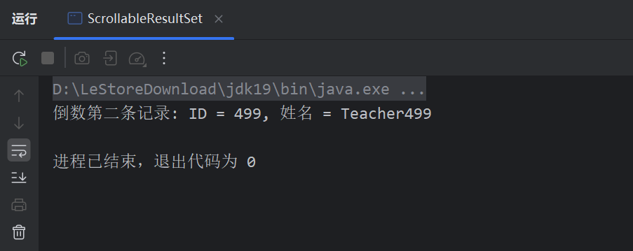

# 《作业五：JDBC操作练习》

> **学院：省级示范性软件学院**
>
> **课程：JavaWeb后端开发技术**
>
> **题目：《作业五：JDBC操作练习》**
>
> **姓名：唐玉亮**
>
> **学号：2100230021**
>
> **班级：软工2202**
>
> **日期：2024-10-24**
>
> **实验环境：MySQL8**

## 1. 实验目的

- 熟练使用 jdbc操作数据库

## 2. 实验内容

### 2.1 完成teacher的CRUD练习，提供CRUD的代码。

#### 2.1.1 Create 增

- 代码：

```java
String insertsql = "insert into teacher(id,name,course,birthday) value (?,?,?,?)";
        try(Connection connection = DriverManager.getConnection(url,username,password);) {
            connection.setAutoCommit(false); //手动提交
            try(PreparedStatement insertpreparedStatement = connection.prepareStatement(insertsql)) {
                //Create---插入一条操作
                insertpreparedStatement.setInt(1, 501);
                insertpreparedStatement.setString(2, "zhangsan");
                insertpreparedStatement.setString(3, "database");
                insertpreparedStatement.setDate(4, Date.valueOf("1998-10-01"));
                insertpreparedStatement.executeBatch();
                System.out.println("记录插入成功");
            }
```


#### 2.1.2 Retrieve 查

- 代码：

``` java
// Retrieve - 读取教师记录
            String readsql = "select * from teacher where id = ?";
            try(PreparedStatement selectpreparedStatement = connection.prepareStatement(readsql)) {
                selectpreparedStatement.setInt(1, 1);
                ResultSet resultSet = selectpreparedStatement.executeQuery();
                while (resultSet.next()) {
                    System.out.println("ID: " + resultSet.getInt("id") + ", 姓名: " + resultSet.getString("name"));
                }
            }
```


#### 2.1.3 Update 改

- 代码：

``` java
//Update - 更新教师记录
            String updatesql = "update teacher set name = ? where id = ?";
            try(PreparedStatement updatepreparedStatement = connection.prepareStatement(updatesql)) {
                // 设置参数
                updatepreparedStatement.setString(1, "宝儿姐");
                updatepreparedStatement.setInt(2, 2);
                // 执行插入或更新
                updatepreparedStatement.executeUpdate();
                connection.commit();
                System.out.println("记录更新成功");
            }
```


#### 2.1.4 Delete 删

- 代码：

``` jsx
//Delete - 删除教师记录
            String deletesql = "delete from teacher where id = ?";
            try(PreparedStatement deletepreparedStatement = connection.prepareStatement(deletesql)) {
                deletepreparedStatement.setInt(1, 501);
                deletepreparedStatement.executeUpdate();
                connection.commit();
                System.out.println("记录删除成功");
            }
```

#### 2.1.5 总体代码

- 代码

``` java
package com.example;
import java.sql.*;

/**
 * ClassName:TeacherCRUD
 * Package:com.example
 * Description:
 *
 * @Author: 唐玉亮
 * @Craete:2024/10/24 - 21:12
 */
public class TeacherCRUD {
    public static void main(String[] args) {
        //获取连接
        //语法 jdbc:mysql://ip地址：端口号/数据库名称?参数键值对1&参数键值对2...
        String url = "jdbc:mysql://127.0.0.1:3306/jdbc_test";
        String username="root";
        String password="123456";
        String insertsql = "insert into teacher(id,name,course,birthday) value (?,?,?,?)";

        try(Connection connection = DriverManager.getConnection(url,username,password);) {
            connection.setAutoCommit(false); //手动提交
            try(PreparedStatement insertpreparedStatement = connection.prepareStatement(insertsql)) {
                //Create---插入一条操作
                insertpreparedStatement.setInt(1, 501);
                insertpreparedStatement.setString(2, "zhangsan");
                insertpreparedStatement.setString(3, "database");
                insertpreparedStatement.setDate(4, Date.valueOf("1998-10-01"));
                insertpreparedStatement.executeBatch();
                System.out.println("记录插入成功");
            }

            // Retrieve - 读取教师记录
            String readsql = "select * from teacher where id = ?";
            try(PreparedStatement selectpreparedStatement = connection.prepareStatement(readsql)) {
                selectpreparedStatement.setInt(1, 1);
                ResultSet resultSet = selectpreparedStatement.executeQuery();
                while (resultSet.next()) {
                    System.out.println("ID: " + resultSet.getInt("id") + ", 姓名: " + resultSet.getString("name"));
                }
            }

            //Update - 更新教师记录
            String updatesql = "update teacher set name = ? where id = ?";
            try(PreparedStatement updatepreparedStatement = connection.prepareStatement(updatesql)) {
                // 设置参数
                updatepreparedStatement.setString(1, "宝儿姐");
                updatepreparedStatement.setInt(2, 2);
                // 执行插入或更新
                updatepreparedStatement.executeUpdate();
                connection.commit();
                System.out.println("记录更新成功");
            }

            //Delete - 删除教师记录
            String deletesql = "delete from teacher where id = ?";
            try(PreparedStatement deletepreparedStatement = connection.prepareStatement(deletesql)) {
                deletepreparedStatement.setInt(1, 501);
                deletepreparedStatement.executeUpdate();
                connection.commit();
                System.out.println("记录删除成功");
            }
        } catch (SQLException e) {
            e.printStackTrace(); //打印异常信息
        }
    }
}
```

- 运行结果：

  

### 2.2 完成teacher表的批量插入练习，插入500个教师，每插入100条数据提交一次。

- 编写批量插入代码：

``` java
package com.example;

import java.sql.*;
import java.text.ParseException;
import java.text.SimpleDateFormat;

/**
 * ClassName:JdbcTest
 * Package:com.example
 * Description:
 *
 * @Author: 唐玉亮
 * @Craete:2024/10/24 - 15:15
 */
public class JdbcTest {//批量插入
    public static void main(String[] args) {
        //获取连接
        //语法 jdbc:mysql://ip地址：端口号/数据库名称?参数键值对1&参数键值对2...
        String url = "jdbc:mysql://127.0.0.1:3306/jdbc_test";
        String username="root";
        String password="123456";
        String sql = "insert into teacher(id,name,course,birthday) value (?,?,?,?)";

        //CRUD操作
        try(Connection connection = DriverManager.getConnection(url,username,password);) {
            connection.setAutoCommit(false); //手动提交
            try(PreparedStatement preparedStatement = connection.prepareStatement(sql)) {
                // 设置参数
                for (int i = 1; i <= 500; i++) {
                    preparedStatement.setInt(1, i);
                    preparedStatement.setString(2, "Teacher" + i);
                    preparedStatement.setString(3, "Course" + i);

                    //data类型处理1
                    SimpleDateFormat sdf = new SimpleDateFormat("yyyy-MM-dd");
                    String dateString = "1990-01-0" + i;
                    java.util.Date date = sdf.parse(dateString);
                    preparedStatement.setDate(4, new java.sql.Date(date.getTime()));
                    
                    // 添加到批处理
                    preparedStatement.addBatch();

                    if (i % 100 == 0) { // 每100条记录执行一次批处理
                        preparedStatement.executeBatch();// 批量执行
                        preparedStatement.clearBatch();
                    }
                }
                preparedStatement.executeBatch(); // 插入最后剩余的记录
                connection.commit(); // 提交剩余的记录
                System.out.println("完成批量插入数据");
            }catch (SQLException e) {
                connection.rollback();
                e.printStackTrace();
            } catch (ParseException e) {
                throw new RuntimeException(e);
            }
        } catch (SQLException e) {
            e.printStackTrace(); //打印异常信息
        }
    }
}
```


- 运行结果：

	

- 查看数据：


### 2.3 完成可滚动的结果集练习，只查看结果集中倒数第2条数据。

- 代码：

``` jsx
package com.example;
import java.sql.*;

/**
 * ClassName:ScrollableResultSet
 * Package:com.example
 * Description:
 *
 * @Author: 唐玉亮
 * @Craete:2024/10/24 - 22:16
 */
public class ScrollableResultSet {
    public static void main(String[] args) {
        //获取连接
        //语法 jdbc:mysql://ip地址：端口号/数据库名称?参数键值对1&参数键值对2...
        String url = "jdbc:mysql://127.0.0.1:3306/jdbc_test";
        String username="root";
        String password="123456";

        String selectSQL = "SELECT * FROM teacher";
        try(Connection connection = DriverManager.getConnection(url,username,password);) {
            try(PreparedStatement preparedStatement = connection.prepareStatement(selectSQL, ResultSet.TYPE_SCROLL_INSENSITIVE, ResultSet.CONCUR_READ_ONLY);) {

                ResultSet rs = preparedStatement.executeQuery(selectSQL);

                // 滚动到最后一行并向上移动一行，得到倒数第二条记录
                if (rs.last()) {
                    if (rs.previous()) {
                        System.out.println("倒数第二条记录: ID = " + rs.getInt("id") + ", 姓名 = " + rs.getString("name"));
                    }
                }
            }
        } catch (SQLException e) {
            e.printStackTrace(); //打印异常信息
        }
    }
}
```

#### 

- 结果





## 3. 问题及解决办法